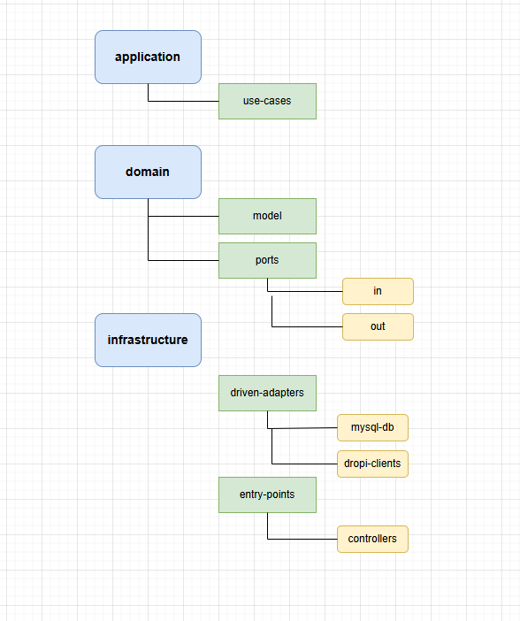

# Todo API Documentation

This is a .NET Core backend API for managing todo items. The API supports basic CRUD operations and includes RabbitMQ integration for status updates.

## API Endpoints

### Get All Todos
- **Endpoint:** `GET /api/todos`
- **Description:** Retrieves all todo items
- **Response:**
```json
[
  {
    "id": 1,
    "title": "string",
    "description": "string",
    "status": "Todo|Doing|Done",
    "createdAt": "2024-12-23T14:04:35Z"
  }
]
```

### Get Todo by ID
- **Endpoint:** `GET /api/todos/{id}`
- **Description:** Retrieves a specific todo item by ID
- **Parameters:**
  - `id` (path parameter): The ID of the todo item
- **Response:**
```json
{
  "id": 1,
  "title": "string",
  "description": "string",
  "status": "Todo|Doing|Done",
  "createdAt": "2024-12-23T14:04:35Z"
}
```

### Get Todos by Status
- **Endpoint:** `GET /api/todos/status/{status}`
- **Description:** Retrieves all todos with a specific status
- **Parameters:**
  - `status` (path parameter): Todo, Doing, or Done
- **Response:** Array of todo items with the specified status

### Create Todo
- **Endpoint:** `POST /api/todos`
- **Description:** Creates a new todo item
- **Request Body:**
```json
{
  "title": "string",
  "description": "string",
  "status": "Todo"
}
```
- **Response:** The created todo item with ID and createdAt timestamp

### Update Todo
- **Endpoint:** `PUT /api/todos/{id}`
- **Description:** Updates an existing todo item
- **Parameters:**
  - `id` (path parameter): The ID of the todo to update
- **Request Body:**
```json
{
  "id": 1,
  "title": "string",
  "description": "string",
  "status": "Todo|Doing|Done"
}
```

### Update Todo Status
- **Endpoint:** `PATCH /api/todos/{id}/status`
- **Description:** Updates only the status of a todo item
- **Parameters:**
  - `id` (path parameter): The ID of the todo to update
- **Request Body:**
```json
{
  "status": "Todo|Doing|Done"
}
```
- **Note:** This endpoint triggers a RabbitMQ event with the status change

### Delete Todo
- **Endpoint:** `DELETE /api/todos/{id}`
- **Description:** Deletes a todo item
- **Parameters:**
  - `id` (path parameter): The ID of the todo to delete

## Data Models

### Todo
```json
{
  "id": "integer",
  "title": "string",
  "description": "string",
  "status": "enum(Todo, Doing, Done)",
  "createdAt": "datetime"
}
```

### TodoStatus
Enum values:
- Todo
- Doing
- Done

## Architecture

This project implements Hexagonal Architecture (also known as Ports and Adapters pattern). The architecture is structured in three main layers:

### Application Layer
- Contains the use cases of the application
- Implements the business logic orchestration
- Use cases interact with the domain through ports

### Domain Layer
- Heart of the application containing the business logic
- Models: Define the core business entities (Todo, TodoStatus)
- Ports: Define the interfaces for incoming and outgoing operations
  - In Ports: Define how external actors can interact with our domain
  - Out Ports: Define how our domain interacts with external services

### Infrastructure Layer
- Contains the technical implementations
- Driven Adapters:
  - MySQL Database adapter for persistence
  - RabbitMQ adapter for event messaging
- Entry Points:
  - REST API Controllers

### Project Structure
```
├── Application
│   └── UseCases
│       └── TodoUseCase.cs
├── Domain
│   ├── Models
│   │   ├── Todo.cs
│   │   └── TodoStatus.cs
│   └── Ports
│       ├── In
│       │   └── TodoPort.cs
│       └── Out
│           └── TodoRepository.cs
└── Infrastructure
    ├── DrivenAdapters
    │   ├── MysqlDb
    │   └── RabbitMQProducer
    └── EntryPoints
        └── Controllers
```



The hexagonal architecture allows us to:
- Keep the domain logic isolated from external concerns
- Make the application more maintainable and testable
- Easily swap infrastructure implementations without affecting the domain
- Ensure that dependencies point inward, with the domain at the center

## Features
- CRUD operations for todo items
- Status filtering
- RabbitMQ integration for status updates
- MySQL database storage
- Clean architecture implementation with Use Cases and Repository pattern

## Technical Details
- Built with .NET Core
- Uses Entity Framework Core for database operations
- Implements RabbitMQ for event messaging
- Follows Clean Architecture principles with separation of concerns